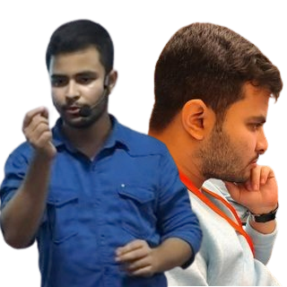

<h1 style="color: teal; font-style:bold; font-size: 3rem"> Welcome Visitor</h1>

<h2><b>Hi, I'm Soumyadip</b></h2>
<h3> Studying <b>MCA</b> in Techno India University
 
Graduate in PHYSICS from Calcutta Universiry</h3>

<button style="background-color:white; height:50px; width:200px; box-shadow:black 5px 5px 3px;border-radius:10px; color:black; border:2px solid black;"><a href="https://soumyaco.github.io/Portfolio/portfolio/general.html"><b>My Projects</b></a></button>
<button style="background-color:gray; height:50px; width:200px; box-shadow:black 5px 5px 3px;border-radius:10px; color:orange; border:2px solid black;"><a href="https://soumyaco.github.io/Portfolio/about/index.html"><b>About Me</b></a></button>

  