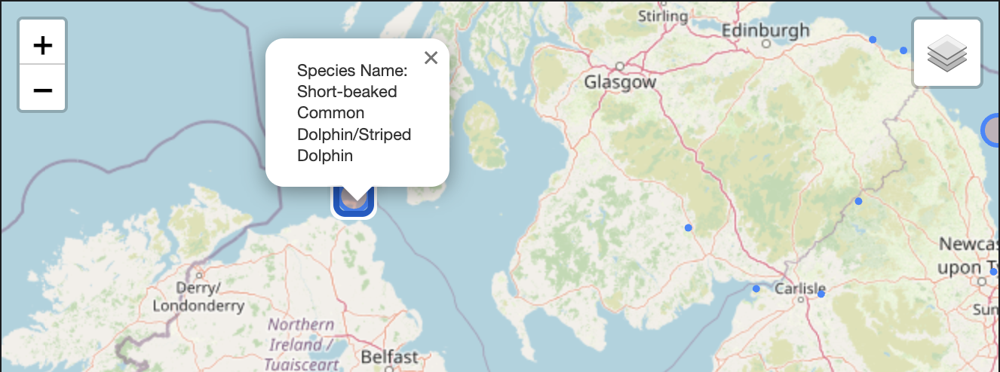

### <b>Geospatial Mapping of Mammals' Habitats (UK)</b>
<h4><i>Geospatial Analysis of Rare Mammals in UK, their possible range of habitats</i></h4>

 

Dataset contains mammal sighting in the UK from the __NBN Atlas__ dataset. It includes geo-spacial information on where sightings have occured, as well as biological information on sighted animals in order to filter for specific taxonomies of animals. Data has been modified to removed redundant columns and anonymise the data.
> 1. Taken some functional approach inside notebooks for clean workflow
> 2. Lots of __Data Visualization__ in order to get intricate informations
> 3. State/Province based Mammals' location analysis
> 4. Mapping the whole Uk and pointing out the mammal's habitat (and possible range with circle)

{ width="700" }

{ width="700" }

---

### <b>Hotel Price Data Analysis (Bangalore, India) </b>
<h4><i>Analysis of Hotel Price with respect to location, rating, tourism from <b>MakeMyTrip.com (Bangalore)</b></i></h4>

 

The dataset is available on kaggle you can take a look at the dataset: 🔗 [HERE](https://www.kaggle.com/datasets/andrewgeorgeissac/hotel-price-data-of-cities-in-india-makemytrip). 

Analyzed this data to get some intricate details 

> 1. hotel qualities
> 2. average people choice which kind of hotels
> 3. High rating actually increase number of customers or not
> 4. Average hotel price
> 5. Finding out important landmarks based on the hotel price and no of customers
and many more.

Steps:

* Cleaning the data - Renaming some columns, dropping unnecessary columns etc.
* Visualizing the missing values (with `seaborn` and `missingno` library)
* Plotting correlation between the data [like Price and Tax has a strong correlation etc.]
* Plotting data individually [like Places vs Price, Reviews vs Price etc.]
* Conclusion about the analysis.

{ width="700" }

---
### <b>Female Employment vs Fertility Rate Analysis</b>
<h4><i>The fertility rate and the percentage of female in the total workforce of Bangladesh analysis</b></i></h4>

The datasets span over 23 years (from 1995 to 2017). Data has been collected separately from two surveys carried out by the World Bank for both the fertility rate and the percentage of female in the total workforce of Bangladesh 🇧🇩. These two datasets were compiled into one dataset and it corresponds to the 23 data points for these two variables (__"fertility rate"__ and __"worker percent"__).

{ width="340" }
{ width="340" }

