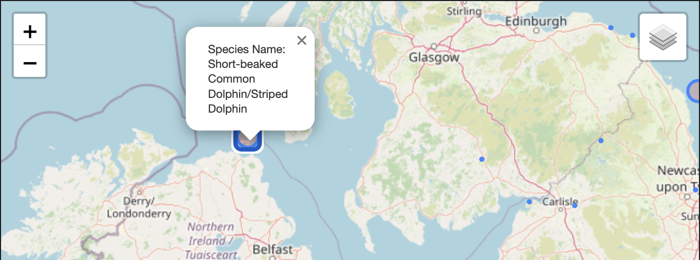
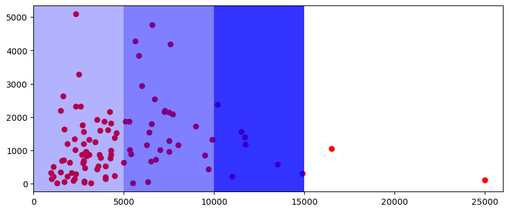
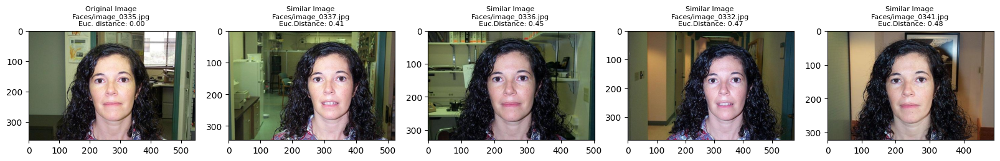

<!-- { width="400" } -->
<h1>MACHINE LEARNING PROJECTS</h1>

<!-- LOGO s -->

### **Machine Learning** Projects and Their **Short Descriptions**

 
## <b>:octicons-rocket-24: Full Stack Machine Learning</b>

### <b>ChatClarity</b>

<h4><i>Whatsapp Chat Analyzer and Context Based Searching</i></h4>

Here we have created a **web application** to analyze Whatsapp group chats. The Web application can generate the following statistics from exported group chat `(*.txt file)`

> 1. The most used words (in past _n_ number of days).
> 2. Most Active members (in past _n_ number of days).
> 3. Anomalies in message counts.
> 4. Username Based searching.
> 5. Context Based searching.

It is fully capable of handaling lots of text messages in a very less amount of time. Because we've used traditional ML methods to optimize the text file input into a tabular format using **RegEx** and **Pandas**. After we've used **Spacy** for **Named Entity Recognition** and **stopping words deletion**. Then using **Flask** we've taken query from _frontend_ (Made with **React** by [@ToukirAhmedKhan](https://github.com/BlackHeart786)) and by using **KNN** we've served the context based searched results.

{ width="340" }{ width="340" }

<b>:octicons-graph-16: Improvements:</b>

Important messages seperation from group chit chats.

---

## <b>:octicons-beaker-24: Data Analytics</b>

### <b>Geospatial Mapping of Mammals' Habitats (UK)</b>

<h4><i>Geospatial Analysis of Rare Mammals in UK, their possible range of habitats</i></h4>

 

Dataset contains mammal sighting in the UK from the **NBN Atlas** dataset. It includes geo-spacial information on where sightings have occured, as well as biological information on sighted animals in order to filter for specific taxonomies of animals. Data has been modified to removed redundant columns and anonymise the data.

> 1. Taken some functional approach inside notebooks for clean workflow
> 2. Lots of **Data Visualization** in order to get intricate informations
> 3. State/Province based Mammals' location analysis
> 4. Mapping the whole Uk and pointing out the mammal's habitat (and possible range with circle)

{ width="700" }

{ width="700" }

---

### <b>Hotel Price Data Analysis (Bangalore, India) </b>

<h4><i>Analysis of Hotel Price with respect to location, rating, tourism from <b>MakeMyTrip.com (Bangalore)</b></i></h4>

 

The dataset is available on kaggle you can take a look at the dataset: 🔗 [HERE](https://www.kaggle.com/datasets/andrewgeorgeissac/hotel-price-data-of-cities-in-india-makemytrip).

Analyzed this data to get some intricate details

> 1. hotel qualities
> 2. average people choice which kind of hotels
> 3. High rating actually increase number of customers or not
> 4. Average hotel price
> 5. Finding out important landmarks based on the hotel price and no of customers
>    and many more.

Steps:

- Cleaning the data - Renaming some columns, dropping unnecessary columns etc.
- Visualizing the missing values (with `seaborn` and `missingno` library)
- Plotting correlation between the data [like Price and Tax has a strong correlation etc.]
- Plotting data individually [like Places vs Price, Reviews vs Price etc.]
- Conclusion about the analysis.

{ width="700" }

---

## <b>:octicons-terminal-24: Data Science</b>

### <b>Diabetes Patient Classification</b>

<h4><i>Predicting Diabetes with KNeighborsClassifier</i></h4>

 

KNeighborsClassifier is a very powerful classification algorithms used to classify with non-linear boundaries. But this model requires some feature engineering:\ I've Performed some feature engineering to fit the data and get the most out of this model.

Imputed Missing values
Scaled the data to have equal importance while the training
Also after training the model to set the best hyperparameter I've used the most used method → `GridSearch`

{ width="700" }

---

### <b>Reverse Image Searching</b>

<h4><i>Predicting Diabetes with KNeighborsClassifier</i></h4>

 

## What is Reverse Image Searching?

Reverse image searching is a technique for finding images that are similar to a given image. It is useful for finding the original source of an image, finding different versions of an image, or finding information about an image.

## Uses cases

Reverse image searching can be used for a variety of purposes, such as:

> 1. Finding the original source of an image, such as a photo or painting
> 2. Finding different versions of an image, such as different sizes or crops
> 3. Finding information about an image, such as its subject matter or creator
> 4. Checking if an image is copyrighted
> 5. Finding out if someone is using your images without permission

{ width="700" }
